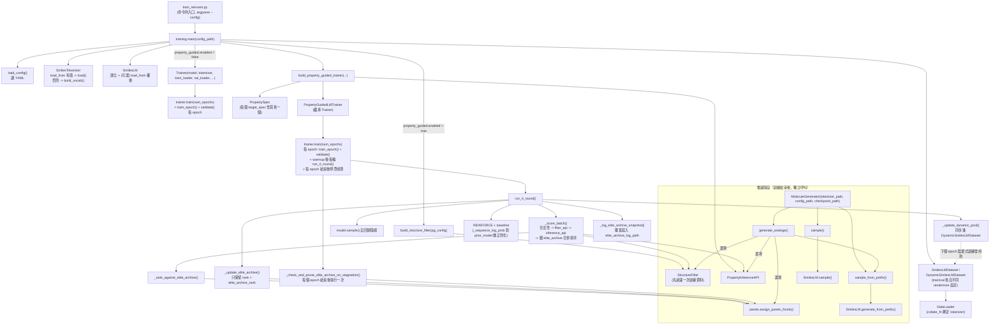
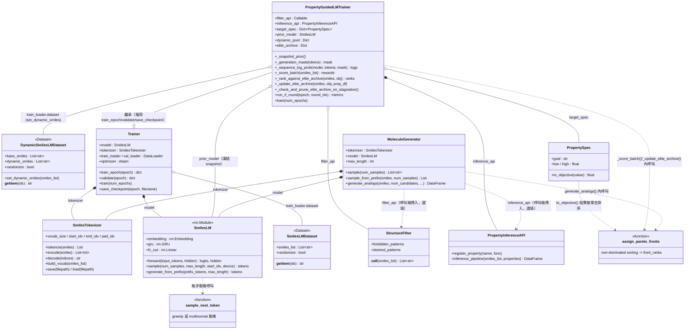

# reinvent_lm

REINVENT 風格的純 autoregressive GRU 語言模型，用於 SMILES 分子生成，並支援
「結構規則過濾 (filter) + 分子性質目標 (pareto front) + REINFORCE」的多目標 RL 微調。

這個專案是 `gruvae/`（GRU/Transformer **VAE**）的姊妹專案，**完全獨立、不依賴 `gruvae`**
（`tokenizer.py`/`filters.py`/`properties.py`/`pareto.py` 是各自獨立的副本）。跟 `gruvae`
最大的差別是：這裡的生成模型**沒有 encoder、沒有連續潛在空間 z**，是單純的
autoregressive 語言模型（比照 Olivecrona et al. 2017 / Blaschke et al. 2020 的 REINVENT）。

---

## 目錄

1. [這個專案在做什麼](#這個專案在做什麼)
2. [架構與訓練原理](#架構與訓練原理)
3. [專案結構](#專案結構)
4. [元件依賴關係圖 (Class Diagram)](#元件依賴關係圖-class-diagram)
5. [安裝需求](#安裝需求)
6. [資料格式](#資料格式)
7. [快速開始](#快速開始)
8. [YAML 設定檔詳細說明](#yaml-設定檔詳細說明)
9. [Property-Guided RL 微調原理](#property-guided-rl-微調原理)
10. [MoleculeGenerator API](#moleculegenerator-api)
11. [Checkpoint 格式](#checkpoint-格式)
12. [跟 gruvae (VAE) 的差異對照](#跟-gruvae-vae-的差異對照)
13. [常見問題 / 訓練監控指標](#常見問題--訓練監控指標)

---

## 這個專案在做什麼

給一批 SMILES 分子當訓練資料，這個專案可以：

1. **預訓練 (pretraining)**：訓練一個 GRU 語言模型，學會「SMILES 這個語法系統」該怎麼寫，
   訓練完之後可以從頭隨機生成合法的新分子。
2. **Property-Guided RL 微調**：在預訓練模型的基礎上，用強化學習（REINFORCE）進一步把
   生成的分子往「你指定的結構規則」與「你指定的性質目標區間」推——例如「一定要含有某個
   官能基」、「ClogP 要落在 5~6.5 之間、同時 SAScore 要越低越好」。
3. **推論階段的分子生成/探索**：訓練完之後用 `MoleculeGenerator` 隨機生成分子，或是針對
   一個既有的分子做「鄰近結構探索」，找出附近可能更好的候選分子。

---

## 架構與訓練原理

### 為什麼不用 VAE，改用純語言模型

`gruvae/` 的 VAE 架構把分子 encode 成一個潛在向量 z，訓練時用 encoder 產生的 z 做
teacher forcing decode，但要「生成新分子」時卻要從 `z ~ N(0, 1)` 隨機抽樣再 decode。
這中間有一個落差：**訓練規則（用 encoder 產生的 z）跟生成規則（隨機抽樣的 z）不是同一件
事**，如果 KL 正則化不夠強，encoder 學到的 z 分布會偏離 N(0,1) 太多，導致隨機抽樣出來的
z 落在 decoder 沒被訓練過的「洞」裡，生成出一堆語法錯誤的垃圾分子（這個專案的姊妹專案
`gruvae` 在實際訓練中就踩過這個坑）。

`reinvent_lm` 換一個做法：**完全不用 encoder、不用潛在空間**，`SmilesLM` 就是一個單純的
GRU 語言模型：

```
輸入 token 序列 --[Embedding]--> 詞向量 --[GRU]--> hidden state --[Linear]--> 下一個 token 的機率分布
```

訓練時（teacher forcing）跟生成時（自回歸）**用的是同一套機制**：都是「給定目前為止的
token 序列，預測下一個 token」，沒有中間那道「先壓縮成 z 再隨機抽樣」的關卡，結構上就不
會有 VAE 那種 prior/posterior 不對齊的問題。這正是 REINVENT 系列論文選擇這種架構的原因。

### 訓練資料怎麼變成模型的輸入/輸出

一個 SMILES 字串（例如 `CCO`）會先被 `SmilesTokenizer` 切成 token（`C`, `C`, `O`），
前後補上特殊 token 後，變成模型訓練用的一組 (input, target) pair：

```
原始 SMILES:      C   C   O
input_seq (給模型): <START> C   C   O
target_seq (答案):        C   C   O   <END>
```

也就是說，模型在每一個位置都在學「看到目前為止這些 token，下一個該接什麼」：
`<START>` 之後接 `C`、看到 `C` 之後接 `C`、看到 `CC` 之後接 `O`、看到 `CCO` 之後接
`<END>`（代表分子寫完了）。訓練 loss 就是每個位置的 cross-entropy 相加（`PAD` 位置不算
loss）。生成新分子時，反過來從 `<START>` 開始，每步用模型當下預測的機率分布抽一個 token
當下一步的輸入，直到抽到 `<END>` 或到達 `max_length`。

### 兩階段訓練流程

```
┌─────────────────────┐        ┌──────────────────────────────────────────┐
│ 階段 1：預訓練        │  ───▶  │ 階段 2：Property-Guided RL 微調 (可選)      │
│ 純 MLE / next-token   │        │ REINFORCE + 結構過濾 + pareto front 排序   │
│ (Trainer)             │        │ (PropertyGuidedLMTrainer)                 │
└─────────────────────┘        └──────────────────────────────────────────┘
```

這兩個階段分別對應 `configs/train_reinvent.yaml`（純預訓練）與
`configs/train_reinvent_property_guided.yaml`（載入預訓練權重、開啟 RL 微調），
細節見下面的 [Property-Guided RL 微調原理](#property-guided-rl-微調原理)。

---

## 專案結構

```
reinvent_lm/
    __init__.py
    tokenizer.py       # SmilesTokenizer：SMILES <-> token id 的編解碼、vocab 建立/存讀
    filters.py         # StructureFilter：結構規則過濾器 (filter_api 的預設實作)
    properties.py      # PropertyInferenceAPI：分子性質計算 (inference_api 的預設實作)
    pareto.py          # PropertySpec + assign_pareto_fronts：多目標 pareto front 排序
    models/
        __init__.py
        sampling.py     # sample_next_token：greedy / multinomial 取樣共用工具
        lm.py           # SmilesLM：GRU decoder-only 語言模型本體
    dataset.py          # SmilesLMDataset / DynamicSmilesLMDataset / collate_fn
    training.py         # Trainer（純預訓練）+ main()：讀 YAML、組裝各元件、啟動訓練
    rl_trainer.py       # PropertyGuidedLMTrainer(Trainer)：REINFORCE 多目標 RL 微調
    generation.py       # MoleculeGenerator：訓練完之後方便使用的生成/探索介面

configs/
    train_reinvent.yaml                    # 純預訓練配置
    train_reinvent_property_guided.yaml    # RL 微調配置

train_reinvent.py        # 根目錄的訓練入口腳本
```

每個檔案底部都有 `if __name__ == "__main__":` 的煙霧測試，可以用
`python -m reinvent_lm.<module>`（例如 `python -m reinvent_lm.models.lm`）單獨執行，
快速確認該模組本身邏輯正確。

---

## 元件依賴關係圖 (Class Diagram)

這個 codebase 有**兩條互相獨立的入口**：訓練（從 `train_reinvent.py` 出發）跟推論
（從 `MoleculeGenerator` 出發），共用同一組底層元件（`SmilesTokenizer`/`SmilesLM`/
`filters`/`properties`/`pareto`）。下面兩張圖分別呈現「執行流程」跟「靜態物件關係」。

### 1. 從 `main()` 出發的執行流程



### 2. 靜態物件關係（Class Diagram）



### 怎麼讀這兩張圖

- **虛線箭頭 (`..>`)**：呼叫/使用某個函式或選填的外部依賴（例如 `MoleculeGenerator` 的
  `filter_api`/`inference_api` 是呼叫端自己傳進來的，`MoleculeGenerator` 本身不擁有它們）。
- **實心菱形 (`*--`)**：強擁有關係（例如 `Trainer.model` 是這個 `Trainer` 建構時就固定
  持有的 `SmilesLM` 實例）。
- **空心菱形 (`o--`)**：較鬆散的持有關係（例如 `train_loader.dataset` 是透過 `DataLoader`
  間接持有，`PropertyGuidedLMTrainer.prior_model` 是訓練過程中才由 `_snapshot_prior()`
  賦值，一開始是 `None`）。
- **`--|>`**：繼承。`PropertyGuidedLMTrainer` 是 `Trainer` 的子類別，這也是為什麼它可以
  直接複用 `train_epoch`/`validate`/`save_checkpoint`，只需要在 `train()` 裡插入 RL 回合。
- **`tokenizer.py`/`filters.py`/`properties.py`/`pareto.py`/`models/sampling.py`** 這幾個
  最底層的模組完全沒有畫「依賴別人」的箭頭——它們是整個依賴圖的葉節點，`training.py`/
  `rl_trainer.py`/`generation.py` 這三個「組裝層」都依賴它們，但反過來不成立，這也是它們
  可以被 `gruvae`/`reinvent_lm` 兩邊各自獨立複製一份、互不影響的原因。
- `training.py` 跟 `generation.py` 是兩個**平行、互不依賴**的入口——訓練完全不需要
  `MoleculeGenerator`，推論也完全不需要 `Trainer`，兩者只透過磁碟上的 `.pt` + `config.yaml`
  + `tokenizer.json` 三份檔案間接銜接（見 [Checkpoint 格式](#checkpoint-格式)）。

---

## 安裝需求

跟 `gruvae/` 共用同一個 Python 環境即可，主要依賴：

- `torch`
- `rdkit`
- `pandas`, `numpy`
- `pyyaml`
- `tqdm`

沒有額外的、`gruvae` 沒有的依賴。

---

## 資料格式

訓練資料是一個 CSV 檔案，**至少要有一欄叫 `smiles`**（其他欄位會被忽略），例如
`data/processed/train_small_processed.csv`：

```csv
smiles,heavy_atoms
CCCS(=O)c1ccc2[nH]c(=NC(=O)OC)[nH]c2c1,19
CC(C)(C)C(=O)C(Oc1ccc(Cl)cc1)n1ccnc1,20
Cn1cnc2c1c(=O)n(CC(O)CO)c(=O)n2C,18
```

- 不需要事先切好 train/val，程式會依 `data.train_split` 自動切分。
- 不需要事先分詞/建 vocab，`SmilesTokenizer.build_vocab()` 會在 `main()` 執行時自動從
  這批 SMILES 建立詞彙表（除非用 `checkpoint.load_from` 載入已有模型，這時會改成沿用
  該模型旁邊的 `tokenizer.json`，見下方說明）。
- SMILES 不需要事先 canonicalize，`Dataset` 內部會自動處理。訓練集預設（`data.randomize_smiles: true`）
  每次取用都會用 RDKit 重新隨機化書寫法（SMILES enumeration）而不是固定用 canonical 寫法——
  同一個分子有非常多種合法但原子順序不同的寫法，只用單一 canonical 寫法訓練容易讓模型記住
  表面模式而非真正的分子語法規則。這是 Bjerrum (2017) 與 Arús-Pous et al. (2019，J.
  Cheminformatics) 針對這類 autoregressive SMILES 生成模型驗證過的資料增強法，能讓生成
  出來的獨特分子數量明顯增加。因為 `DataLoader` 每個 epoch 本來就會重新呼叫一次
  `Dataset.__getitem__`，這個隨機化是「即時」做的（不像原始 REINVENT 官方實作那樣需要
  事先產生好多份枚舉檔案再輪流讀取），成本跟原本呼叫一次 canonicalize 差不多。驗證集固定
  用 canonical 寫法（`randomize` 參數為 `False`），確保每個 epoch 的 val loss/perplexity
  量測基準一致、可以互相比較。

---

## 快速開始

### 1. 純預訓練

```bash
python train_reinvent.py --config configs/train_reinvent.yaml
```

會做的事：讀取 `data.train_csv`、建立詞彙表、訓練 `SmilesLM`，每個 epoch 結束後印出
train/val loss、perplexity，並自回歸生成 `validation.num_sample` 個分子印出來、算
validity rate（RDKit 可解析的比例）。最佳與定期 checkpoint 會存進
`checkpoint.save_dir`。

### 2. Property-Guided RL 微調

先確認 `configs/train_reinvent_property_guided.yaml` 的 `checkpoint.load_from`
指向一個已經訓練好的預訓練 checkpoint（預設指向
`./checkpoints/reinvent_small/best_model.pt`），然後：

```bash
python train_reinvent.py --config configs/train_reinvent_property_guided.yaml
```

### 3. 用訓練好的模型生成/探索分子

```python
from reinvent_lm.generation import MoleculeGenerator

generator = MoleculeGenerator(
    tokenizer_path='./checkpoints/reinvent_small/tokenizer.json',
    config_path='configs/train_reinvent.yaml',
    checkpoint_path='./checkpoints/reinvent_small/best_model.pt',
)

# 隨機生成 5 個新分子
print(generator.sample(5))

# 針對一個既有分子做「鄰近結構探索」
print(generator.sample_from_prefix("CCOc1ccccc1", num_samples=5))
```

更完整的用法（含結構過濾 + 性質排序）見 [MoleculeGenerator API](#moleculegenerator-api)。

---

## YAML 設定檔詳細說明

### `configs/train_reinvent.yaml`（純預訓練）

| 區塊 | 欄位 | 說明 |
|---|---|---|
| `data` | `train_csv` | 訓練資料 CSV 路徑，須含 `smiles` 欄 |
| | `train_split` | 訓練/驗證切分比例（例如 0.9 = 90% 訓練） |
| | `max_length` | SMILES 序列的最大 token 長度（含 START/END），超過會被截斷 |
| | `randomize_smiles` | 預設 `true`。訓練時每次取用是否用 RDKit 重新隨機化 SMILES 書寫法（SMILES enumeration，見下方說明）；驗證集不受影響，固定用 canonical 寫法 |
| `model` | `embedding_dim` | token embedding 維度 |
| | `hidden_dim` | GRU hidden state 維度 |
| | `num_layers` | GRU 層數 |
| | `dropout` | GRU 層間 dropout（`num_layers=1` 時會被忽略） |
| `training` | `num_epochs` | 訓練總 epoch 數 |
| | `batch_size` | batch 大小 |
| | `learning_rate` | Adam 學習率 |
| | `num_workers` | DataLoader worker 數 |
| | `grad_clip_max_norm` | 梯度裁剪上限 |
| `validation` | `num_sample` | 每個 epoch 驗證時自回歸生成幾個分子來算 validity rate |
| `checkpoint` | `save_dir` | checkpoint / tokenizer.json 存放目錄 |
| | `save_interval` | 每幾個 epoch 存一次 `checkpoint_epoch_N.pt`（另外 val loss 創新低時都會存 `best_model.pt`） |
| | `load_from` | (可選) 之前訓練好的 `.pt` 路徑，設定後會先載入該權重繼續訓練/微調；同時會自動嘗試載入**同目錄下**的 `tokenizer.json` 以確保詞彙表一致（詞彙表不一致的話，權重的 embedding/輸出層索引會完全對不上，模型會壞掉） |
| `device` | `use_cuda` | 是否使用 CUDA（不可用時自動退回 CPU） |
| 頂層 | `seed` | 隨機種子（`torch`/`numpy`/`random` 都會設定） |

### `configs/train_reinvent_property_guided.yaml`（RL 微調）

在上面所有欄位之外，多一個 `property_guided` 區塊（`enabled: true` 才會啟用）：

| 欄位 | 預設值 | 說明 |
|---|---|---|
| `enabled` | — | 是否啟用 RL 微調模式。啟用後訓練資料會**先過濾成只含合規 SMILES**，並改用支援動態增減的 `DynamicSmilesLMDataset` |
| `max_length` | 沿用 `data.max_length` | RL 取樣生成分子時的最大長度 |
| `num_samples_per_round` | 256 | 每個 RL round 取樣幾個分子來算 reward、更新一次模型 |
| `num_rl_rounds_per_epoch` | 1 | 每個 epoch（做完監督式訓練後）跑幾個 RL round |
| `warmup_epochs` | 5 | 前幾個 epoch 只做監督式訓練（不啟動 RL），讓模型先把基本語法學好；warmup 結束那一刻（`epoch == warmup_epochs + 1`）會把當時的模型 snapshot 下來當作 RL 的 **prior**（之後永遠不會再更新，見下節說明） |
| `supervised_training_during_rl` | true | warmup 結束、RL 開始之後，是否每個 epoch 仍要做一次監督式訓練（`train_epoch`）。設 `false` 時 warmup 結束後只靠 RL（`loss_pg` + prior 正則化）更新模型，不再穿插監督式訓練，跟 REINVENT 原版 Agent 微調階段的做法一致；不影響 warmup 期間（warmup 本身就是監督式訓練）。設 `false` 時動態訓練池仍會照常累積，但不會再被拿去訓練，可視情況一併關掉 `dynamic_training_data.enabled` |
| `reward_invalid` | -1.0 | RDKit 無法解析的分子的 reward |
| `reward_structure_fail` | -0.5 | 合法但沒通過 `structure_filter` 的分子的 reward |
| `reward_pass_base` | 0.0 | 通過結構檢查、但相對於 `elite_archive` 的 pareto rank 最差（超過 `elite_archive_rank`）的分子的 reward |
| `reward_pass_max` | 1.0 | 通過結構檢查、且相對於 `elite_archive` 的 pareto rank 最好（rank 0）的分子的 reward |
| `elite_archive_rank` | 5 | 「菁英 archive」保留 pareto rank 0 ~ (`elite_archive_rank`-1) 的**所有**分子（依名次篩選，不是固定數量），同時也是 reward 名次縮放的分母上限，細節見下節「Elite Archive」 |
| `reward_scale_power` | 1.0 | reward 名次縮放曲線的指數，`scale = (1 - rank/(elite_archive_rank-1)) ** reward_scale_power`。預設 1.0 是線性；調大（例如 2、3）會放大前幾名之間的 reward 差距、壓縮後段名次的差距 |
| `archive_stagnation_patience_epochs` | 3 | 連續幾個 epoch，`elite_archive` 的第 `archive_stagnation_watch_rank` 層成員完全沒有變化就視為訓練停滯，觸發一次 archive 清理 |
| `archive_stagnation_watch_rank` | 1 | 停滯偵測要盯著看的 pareto rank（0-indexed，`1` = 你平常講的「front 2」）。不盯 rank 0 是因為 rank 0 本來就最難改善，長期不變是正常現象 |
| `archive_prune_keep_rank` | 1 | 觸發停滯清理時，`elite_archive` 只保留 `rank < archive_prune_keep_rank` 的分子，其餘全部清掉，讓中段名次重新空出來競爭 |
| `prior_kl_weight` | 0.1 | 對凍結 prior 做正則化的權重，防止 RL 微調時生成多樣性崩潰（mode collapse），細節見下節 |
| `sampling_temperature` | 1.0 | RL 取樣（multinomial）時的溫度，越高越隨機/多樣 |
| `structure_filter.max_ring_size` | 8 | 環大小上限 |
| `structure_filter.max_heavy_atoms` | 60 | 重原子數上限 |
| `structure_filter.min_heavy_atoms` | 2 | 重原子數下限 |
| `structure_filter.forbidden_smarts` | 內建示範規則 | 黑名單 SMARTS 列表，符合任一個就濾掉 |
| `structure_filter.desired_smarts` | 不限制 | 白名單/必要 SMARTS 列表，分子要符合才會通過 |
| `structure_filter.require_all_desired` | true | `desired_smarts` 要全部符合(true)還是符合一個就好(false) |
| `target_spec.<性質名>.goal` | — | `maximize` / `minimize` / `range`，見下方 `PropertySpec` 說明 |
| `target_spec.<性質名>.low/high` | — | `goal: range` 時必填的區間 |
| `dynamic_training_data.enabled` | true | 是否把合規分子動態同步進訓練資料 |
| `dynamic_training_data.max_pool_size` | 500 | 動態訓練池最多保留幾個分子 |
| `front1_log_path` | `<save_dir>/front1_log.csv` | 每輪 front 1（相對於 `elite_archive` 的 rank 0）分子的 CSV log 路徑（累積 append） |
| `elite_archive_log_path` | `<save_dir>/elite_archive_log.csv` | `elite_archive` 目前保留的全部分子快照，每輪更新完就覆蓋寫入一次（不留存歷史） |

`target_spec` 支援的性質名稱由 `PropertyInferenceAPI` 決定，內建 `ClogP` / `SAScore` /
`MolWt` / `QED` / `TPSA`（用 RDKit 描述子計算，`SAScore` 若環境有 RDKit contrib 的
`sascorer` 會用那個，否則用內建的簡化啟發式估計），也可以用
`inference_api.register_property(name, func)` 自行擴充。

---

## Property-Guided RL 微調原理

`PropertyGuidedLMTrainer`（`rl_trainer.py`）繼承 `Trainer`，複用預訓練的
`train_epoch`/`validate`/`save_checkpoint`，只在 `train()` 的 epoch 迴圈中，
warmup 結束後每個 epoch 額外插入 `num_rl_rounds_per_epoch` 次 RL 更新回合。warmup 期間
（`epoch <= warmup_epochs`）一定會做監督式訓練；warmup 結束後預設仍會繼續做監督式訓練，
但可以用 `supervised_training_during_rl: false` 關掉，讓 RL 開始之後完全只靠
`loss_pg` + prior 正則化更新模型（跟 REINVENT 原版 Agent 微調階段一致）——這麼做的理由是：
`prior_kl_weight` 正則化本身已經承擔了「別離原始化學空間太遠」的角色，跟監督式訓練
防止 mode collapse 的功能有重疊，兩者同時對模型施力方向不一定一致，關掉監督式訓練
可以讓 RL 的梯度訊號更乾淨、不被稀釋，但也少了監督式訓練「拉回」多樣性的效果，
建議搭配追蹤生成分子的多樣性（而不只是 `mean_reward`/`pass_filter`）來判斷是否適合
你的情境。

### 一個 RL round 的完整流程（`run_rl_round`）

1. **取樣**：用目前的模型從 `<START>` 開始做 multinomial 自回歸取樣（`sampling_temperature`
   控制隨機程度），一次生成 `num_samples_per_round` 個分子。
2. **評分**（`_score_batch`）：
   - RDKit 都無法解析 → reward = `reward_invalid`
   - 合法但沒通過 `filter_api` → reward = `reward_structure_fail`
   - 合法且通過 `filter_api` → 用 `inference_api` 算出 `target_spec` 指定的性質，
     把每個性質轉成「越小越好」的目標值（`PropertySpec.to_objective`：`maximize` 取負、
     `minimize` 不變、`range` 取超出區間的距離、區間內為 0），再跟 `elite_archive`
     （見下方「Elite Archive：跨輪穩定的 reward 比較基準」）合併做一次
     `assign_pareto_fronts`（向量化的 non-dominated sorting），取得「相對於歷史最佳
     前緣」的 pareto rank（而不是只跟同一輪隨機抽到的分子比較）。reward 依
     `capped_rank = min(rank, elite_archive_rank-1)` 用
     `scale = (1 - capped_rank/(elite_archive_rank-1)) ** reward_scale_power` 在
     `[reward_pass_base, reward_pass_max]` 之間內插（rank 0 最好，拿
     `reward_pass_max`；名次超過 `elite_archive_rank` 一律視為打平，只拿
     `reward_pass_base`）。
3. **REINFORCE + baseline**：
   - `advantage = reward - batch 內 reward 的平均值`（batch-mean baseline，數學上不偏，
     只是拿來降低梯度估計的變異數）
   - 重新對生成出來的 tokens 做一次 teacher-forced forward，取得
     `seq_logp = sum_t log p(token_t)`（`_sequence_log_prob`，只算到第一個 `<END>` 為止）
   - `loss_pg = -mean(advantage * seq_logp)`：reward 比平均好的分子，會被鼓勵提高自己
     的生成機率；比平均差的分子則被壓低機率。
4. **Prior 正則化**（防止 mode collapse）：
   - warmup 結束那一刻，程式會 `copy.deepcopy(self.model)` 凍結一份當作 `prior_model`，
     **之後整個訓練過程都不會再更新這份 snapshot**（等同 REINVENT 的 Prior/Agent 設計：
     Prior 永遠固定，Agent 持續被 RL 更新）。
   - `loss_prior = mean((seq_logp - prior_seq_logp)^2)`：現在的模型跟這份凍結 prior 對
     同一批生成序列算出來的 log-prob 差距，加上 `prior_kl_weight` 權重後跟 `loss_pg`
     相加成 `loss_rl`，backward 更新。
   - **為什麼不週期性重新 snapshot prior**：如果每隔幾個 epoch 就把「現在的樣子」重新
     定義成新標準，等於每一輪都對上一輪的漂移蓋章認證，長期下來可能累積出監控不出來的
     緩慢崩潰（每一步的 `loss_prior` 看起來都很小很健康，但整體已經跑到很遠的地方）。
     固定 prior 才是「整個訓練過程的總帳」，這也是 REINVENT 系列論文的做法。
5. **更新動態訓練池**（`_update_dynamic_pool`，`dynamic_training_data.enabled=true` 時）：
   - 這一輪通過結構檢查的分子（連同它們的性質目標值）併入一個
     `canonical_smiles -> {smiles, objective}` 的池子；同一個分子重複出現時只留比較好的
     那筆紀錄。
   - 池子超過 `max_pool_size` 時，對**整個池子**重新做一次 pareto front 排序，只保留
     排名最好的 `max_pool_size` 個（同一層 front 內不細分優劣，用穩定排序保留原順序）。
   - 最後把池子目前的內容整批同步進 `train_loader.dataset`（`DynamicSmilesLMDataset`
     的 `set_dynamic_smiles()`），下一個 epoch 的監督式訓練就會用到這些「持續勝出」的
     分子——這是讓「訓練資料本身隨訓練過程改變」的機制。
   - 這個機制要求 `train_loader.dataset` 支援 `set_dynamic_smiles()`；不支援的話會自動
     停用並印警告。
6. **Front 1 監看 log**（`_log_front1_molecules`）：每一輪相對於 `elite_archive` 的
   pareto rank 為 0（最好的一層）的分子，會印出來並累積寫進 `front1_log_path` 這個 CSV
   （欄位：`epoch, round, smiles, <性質1>, <性質2>, ...`），方便訓練過程中打開監看進度。
7. **更新 Elite Archive**（`_update_elite_archive`）與寫入快照（`_log_elite_archive_snapshot`）：
   細節見下方獨立小節。
8. **停滯偵測與清理**（`_check_and_prune_elite_archive_on_stagnation`，每個 epoch 結束後
   跑一次）：細節見下方獨立小節。

### Elite Archive：跨輪穩定的 reward 比較基準

早期版本的 `_score_batch` 只對「這一輪剛採樣出來的分子」彼此做 pareto 排序，這在訓練
後期會有兩個問題：(1) 每一輪的 max front 數會因為抽樣組成不同而忽大忽小，reward 尺度
跟著不穩定；(2) 只跟同一輪隨機抽到的分子比較，沒辦法反映「有沒有比歷史最好的分子更好」。

`elite_archive` 是一個獨立於 `dynamic_pool` 的小型 buffer（`canonical_smiles ->
{smiles, objective, properties}`），**只用來當 reward 的比較基準，不會被拿去訓練模型**：

- **評分時**（`_rank_against_elite_archive`）：把這一輪通過結構檢查的分子跟 archive
  目前的成員合併，一起做一次 pareto front 排序，只取「這一輪分子」對應的名次——這個
  名次是相對於「目前為止看過最好的一批分子」，不是只跟同一輪的分子比較。archive 是空的
  （訓練剛開始）時，會自然退化成單純對這一輪分子排序。
- **更新時**（`_update_elite_archive`，每輪結束後執行）：新分子併入 archive，全部重新
  排序，**只保留 `rank < elite_archive_rank` 的所有分子**——是依 pareto rank 篩選，
  不是固定數量，同一層裡不管有幾個分子都會全部留著。
  > ⚠️ 注意：因為是依 rank 篩選，如果同一個 rank 內同時有很多分子打平（例如多個
  > `range` 型性質都達標、在該維度上都壓到同一個最低目標值 0），archive 大小可能會
  >持續成長、沒有上限，建議留意每輪 log 裡的 `elite_archive` 數字。
- `elite_archive_rank` 同時也是 reward 名次縮放的分母上限：數字越小，reward 在「前段
  班」內的差異就被放大越多；數字越大，能容納的名次分佈越細，但每一階的 reward 差異會
  被稀釋。`reward_scale_power`（預設 1.0 為線性）可以進一步把縮放曲線變成凹曲線
  （`scale = linear_scale ** power`），在不改變 `elite_archive_rank` 的前提下，讓前幾名
  之間的 reward 差距被放大、後段名次彼此更接近（但仍平滑遞減到 `reward_pass_base`，
  不會斷崖式歸零）。
- **`elite_archive_log_path`**：每一輪更新完 archive 之後，把 archive 目前保留的**全部**
  分子（SMILES、各性質原始數值、archive 內部依 rank 排序後的名次）整批**覆蓋**寫進這份
  CSV（不像 `front1_log_path` 是累積 append）——因為 archive 本身每輪都在更新，只需要
  看最新狀態，不需要留存歷史 epoch 紀錄。

### 訓練後期的停滯問題與 Archive 清理

`elite_archive` 穩定下來後（尤其目標是多個窄範圍 `range` 同時達標時），新採樣的分子會
很難再贏過/打平 archive 現有的成員，導致大部分分子的 pareto rank 都掉到
`elite_archive_rank` 之外，只能拿到同一個 `reward_pass_base`——這一批的 reward 變異數
會急遽下降，REINFORCE 的 `advantage = reward - batch_mean` 對大部分樣本趨近於 0，
訓練表面上還在跑，實際上梯度訊號幾乎消失。

`_check_and_prune_elite_archive_on_stagnation`（每個 epoch 結束後執行一次）用一個簡單
的機制緩解這個問題：

1. 追蹤 archive 裡第 `archive_stagnation_watch_rank` 層（預設 `1`，也就是 rank 1／
   「front 2」）的分子集合，如果連續 `archive_stagnation_patience_epochs` 個 epoch
   都跟上一次記錄的集合完全相同，就判定為停滯。
   > 為什麼不盯 rank 0（front 1）：rank 0 是最難改善的一層，就算 archive 其他部分還在
   > 活躍競爭、持續有進步，rank 0 本身很可能好一陣子都不會變（正常現象，不代表停滯），
   > 拿它當觸發條件容易太早/太常誤判。
2. 一旦判定停滯，把 archive 清到只剩 `rank < archive_prune_keep_rank`（預設只留
   rank 0）的分子，其餘全部清掉，然後把計數器歸零重新開始追蹤。因為 pareto rank 0 是
   由「archive 裡最強的那些分子彼此的支配關係」決定的，清掉較弱的分子**不會**讓 rank 0
   的門檻變低——降低的只是中段名次的競爭門檻，讓中段的改善重新可以被 reward 看見，而
   不是全部卡在同一個 `reward_pass_base`。
3. 每個 epoch 都會印一行狀態，方便觀察目前的停滯計數：
   ```
   Elite archive rank 1 連續 2/3 個 epoch 未更新
   ⚠ 已觸發停滯清理：archive 清到只剩 rank < 1 的分子（8 -> 3 個分子），重新開放中段名次的競爭
   ```

**注意**：清理前後的 reward/`mean_reward` 數字不能直接比較——清理瞬間，同一個分子算出
來的 rank（進而 reward）可能會突然變好，純粹是因為比較對象變少了，不是分子真的變強。
比較可靠的做法是看 `elite_archive_log.csv`/`front1_log.csv` 裡實際的分子跟性質數值。

### 每輪印出的統計數字怎麼看

```
[RL round 1/20] sampled=1024 valid=1020 pass_filter=180 front1=9 max_front=42 top5_fronts(1-5)=[9, 15, 22, 18, 20] dynamic_pool=3200 elite_archive=10 mean_reward=0.35 loss_pg=-0.12 loss_prior=1.84
```

- `sampled` / `valid`：這輪取樣了幾個、其中幾個是 RDKit 能解析的合法分子
- `pass_filter`：合法且通過 `structure_filter` 的數量
- `front1`：通過結構檢查的分子裡，相對於 `elite_archive` 的 pareto rank 為 0 的數量
- `max_front`：這一輪分子（相對於 `elite_archive` 合併排序後）出現過的最大 rank，訓練
  後期這個數字如果變得很大（例如 50+），代表 reward 名次縮放被拉得很稀，是考慮調整
  `elite_archive_rank`/`reward_scale_power` 的訊號
- `top5_fronts(1-5)`：這一輪分子裡，rank 0～4（前五層）各自有幾個，比單看 `front1`
  更能看出「差一點點」的分子有多少
- `dynamic_pool`：目前動態訓練池累積的分子數（拿去訓練模型用）
- `elite_archive`：目前 `elite_archive` 實際保留的分子數（只當 reward 比較基準用，
  不會被拿去訓練模型；因為是依 rank 篩選、不是固定數量，這個數字沒有上限，需要留意）
- `mean_reward` / `loss_pg` / `loss_prior`：見上面流程說明。**如果 `loss_prior` 開始
  隨訓練不斷暴增（例如從個位數飆到幾萬幾十萬），通常代表模型已經嚴重偏離 warmup 時的
  樣子，是 mode collapse 的警訊**，可以考慮調高 `prior_kl_weight`、拉長 `warmup_epochs`，
  或檢查 reward 是否過於稀疏（`pass_filter` 長期趨近 0 也是同一類警訊）。
- 每個 epoch 結束後還會多印一行 `Elite archive rank N 連續 X/M 個 epoch 未更新`，是
  停滯偵測的計數狀態，細節見上面「訓練後期的停滯問題與 Archive 清理」。

---

## MoleculeGenerator API

`reinvent_lm/generation.py` 的 `MoleculeGenerator`，訓練完之後方便使用的推論介面。

### 初始化

```python
from reinvent_lm.generation import MoleculeGenerator

generator = MoleculeGenerator(
    tokenizer_path='./checkpoints/reinvent_small/tokenizer.json',
    config_path='configs/train_reinvent.yaml',   # 提供模型架構參數 (embedding_dim 等)
    checkpoint_path='./checkpoints/reinvent_small/best_model.pt',
    device=None,   # 不填會自動偵測 cuda/cpu
)
```

（也支援直接傳入已經存在的 `model`/`tokenizer`/`max_length` 三個參數，適合模型已經在
記憶體中、不想重新從磁碟載入權重的情境；一般使用建議用上面「從檢查點載入」的方式。）

### `sample(num_samples, sampling_mode='multinomial', temperature=1.0, display_molecules=False, mols_per_row=10, max_mols_per_image=100) -> List[str]`

從 `<START>` 開始隨機生成 `num_samples` 個全新分子。`sampling_mode` 可以是
`'multinomial'`（依機率分布抽樣，有多樣性）或 `'greedy'`（每步都選機率最大的 token，
結果是確定性的，多次呼叫會拿到一樣的分子）。

### `sample_from_prefix(smiles, num_samples, truncate_fraction=None, truncate_fraction_range=(0.3, 0.7), randomize_input=True, sampling_mode='multinomial', temperature=1.0, display_molecules=False, mols_per_row=10, max_mols_per_image=100) -> List[str] | List[List[str]]`

因為這個架構**沒有連續潛在空間**，沒辦法像 VAE 那樣「編碼成 z、加點雜訊、解碼回來」做
鄰近探索。這裡改用**截斷種子分子的 token 序列、讓模型接續自回歸生成剩下的部分**：

```
種子分子: CCOc1ccccc1
                └──┬──┘
              截斷到某個比例，例如 40% -> "CCOc"
                     │
        模型從這裡開始自回歸接續生成 ──▶ "CCOc1ccc(S(=O)(=O)NC(C)(C#N)CCC#N)cc1"
```

`smiles` 可以是**單一字串**（回傳 `List[str]`，長度 `num_samples`），也可以是**一個
SMILES list**（回傳 `List[List[str]]`，跟輸入順序一一對應，每個子 list 長度都是
`num_samples`）——給 list 時會分別對每一個輸入各自做鄰近探索，互不影響。

**`randomize_input=True`（預設開啟）：SMILES enumeration 增加多樣性**。因為同一個分子
可以有非常多種合法但原子書寫順序不同的 SMILES 表示法，若每次都截斷同一個固定的（canonical）
寫法，切出來的子結構永遠是同一批。開啟這個選項後，每個樣本在截斷前都會先用 RDKit 重新做
一次隨機書寫（`Chem.MolToSmiles(doRandom=True)`，即 `tokenizer.randomize_smiles`），
同一個分子因此會從不同的「切點」暴露出不同的子結構，能大幅增加鄰近探索的多樣性；不想要
這個效果的話設 `randomize_input=False` 即可（例如你想精準控制截斷的是原始輸入字串本身）。

實作上：每個樣本各自獨立抽「要不要隨機重寫」→「用哪個截斷比例」→ 得到自己的 prefix
token 序列，長度可能都不一樣（不同隨機書寫法的 token 數不保證相同）。程式會依 prefix
長度分組，同一組內長度一致才一起 batch 做 teacher forcing，避免長度不同時得靠 padding
湊齊、進而汙染 hidden state 的問題。

### `generate_analogs(smiles, num_candidates=100, ..., randomize_input=True, filter_api=None, inference_api=None, target_spec=None, dedupe=True, top_k=None, display_molecules=False, mols_per_row=10, max_mols_per_image=100) -> pd.DataFrame`

把 `sample_from_prefix` 取樣、去重複/去無效、`filter_api` 結構過濾、
`inference_api` + `target_spec` 的 pareto front 排序串起來，一次做完「找一個（或一批）
分子附近更好的候選」：

```python
from reinvent_lm.filters import StructureFilter
from reinvent_lm.properties import PropertyInferenceAPI
from reinvent_lm.pareto import PropertySpec

df = generator.generate_analogs(
    ["CCOc1ccccc1", "CCN(CC)CC"],   # 也可以只給單一字串
    num_candidates=100,             # 「每個」種子取樣的候選數
    filter_api=StructureFilter(),
    inference_api=PropertyInferenceAPI(),
    target_spec={
        "ClogP": PropertySpec(goal="range", low=1.0, high=3.0),
        "SAScore": PropertySpec(goal="minimize"),
    },
    top_k=10,
)
```

`smiles` 給一個 list 時，**所有種子的候選分子會合併成同一個候選池一起去重複、過濾、
排序**（而不是每個種子分開各自排序），可以直接把一組 lead 化合物丟進來，一次拿到整組
裡面「附近最好的候選」。回傳的 `DataFrame` 欄位為 `['smiles', 'seed']`（沒給
`target_spec` 時），或 `['smiles', 'seed', <性質欄位...>, 'front_rank']`
（`front_rank` 越小代表越好，`top_k` 只取排序後前幾筆）。`seed` 欄記錄每個候選分子是
從哪個輸入種子生成的，需要的話可以自行 `df.groupby('seed')` 拆開看；`dedupe=True` 時
會排除跟**任一個**輸入種子相同的候選。`filter_api`/`inference_api` 不填的話就不做結構
過濾/性質排序，只回傳去重複、去無效之後的候選分子。

### 顯示分子結構圖（`display_molecules`）

`sample`/`sample_from_prefix`/`generate_analogs` 三個函式都支援
`display_molecules=True`，會額外把這次生成/篩選出來的分子畫成結構網格圖：
每列 `mols_per_row`（預設 10）個，每張圖最多 `max_mols_per_image`（預設 100）個，
超過會自動切成多張圖依序顯示。`generate_analogs` 有給 `target_spec` 時，legend
會標上 `front=<front_rank>` 方便一眼看出排序好壞；`sample_from_prefix` 給一個
SMILES list 時，legend 會標上 `[seed i]` 標記每個鄰近分子來自哪個種子。

```python
generator.sample(20, display_molecules=True, mols_per_row=5)
```

**只有在真的於 Jupyter/IPython kernel 裡執行時才會內嵌顯示圖片**（用
`'ipykernel' in sys.modules` 判斷）；在一般的 python 腳本裡呼叫，會改成把每一頁
存成一個 `.svg` 檔案（存在系統暫存目錄，路徑會印出來），需要自己另外打開看。
這是刻意的設計，不是偷懶：這台開發機的環境下，只要在呼叫過 RDKit 的
`Chem`/`Draw` 之後才第一次 `import IPython`，就算完全不呼叫 `display()`，
process 也會直接 segfault（已確認是環境層級的 shared library 衝突，不是
邏輯錯誤）；用 `sys.modules` 判斷完全不會觸發新的 IPython import——真的在
notebook 裡執行時，`ipykernel` 這個模組本來就已經被 kernel process 自己載入過了，
這時候用它是安全的。畫圖也一律用 `useSVG=True`（而不是 RDKit 預設的 raster/PNG
模式），因為部分環境下 raster 模式搭配 legend 文字一樣會讓 FreeType 字型渲染
segfault。

---

## Checkpoint 格式

`.pt` 檔案內容（`save_checkpoint` 存的）：

```python
{
    'epoch': int,
    'model_state_dict': ...,      # SmilesLM.state_dict()
    'optimizer_state_dict': ...,  # Adam optimizer.state_dict()
    'history': {...}               # 每個 epoch 的 loss/perplexity/validity 歷史紀錄
}
```

**注意：模型架構參數（`embedding_dim`/`hidden_dim`/`num_layers`/`dropout`）不會存在
`.pt` 裡**，只存權重本身。所以要重建模型（例如 `MoleculeGenerator` 從檢查點載入，或是
`checkpoint.load_from` 續訓）時，除了 `.pt` 之外，還需要：

- 訓練當時用的 **config YAML**（提供 `model` 區塊的架構參數）
- 同一個 `save_dir` 底下的 **`tokenizer.json`**（提供詞彙表，`load_from` 時會自動嘗試
  載入同目錄的 `tokenizer.json`）

三者（`.pt` + YAML + `tokenizer.json`）要對得起來才能正確重建模型；詞彙表不一致的話，
權重的 embedding/輸出層索引會完全對不上，模型會壞掉但不一定會直接報錯。

---

## 跟 gruvae (VAE) 的差異對照

| | `gruvae`（VAE） | `reinvent_lm`（純語言模型） |
|---|---|---|
| 生成模型架構 | Encoder + 潛在空間 z + Decoder | 單純 GRU decoder-only（無 encoder/z） |
| 訓練 loss | Reconstruction (cross-entropy) + KL 散度 | 純 next-token cross-entropy |
| 生成方式 | `z ~ N(0,1)` 隨機抽樣後 decode | 從 `<START>` 直接自回歸生成 |
| 訓練/生成規則是否一致 | 不完全一致（隔著 encoder/prior 假設） | 完全一致（teacher forcing = 自回歸的同一套機制） |
| 已知風險 | KL 太弱時 prior/posterior 不對齊，隨機採樣容易生成垃圾 | 沒有這類問題，但 REINFORCE 本身固有的 reward-hacking/mode collapse 風險仍在 |
| 額外能力 | 潛在空間插值 (`interpolate_molecules`)、鄰近點採樣 (`sample_around`) | 無連續潛在空間，改用 `sample_from_prefix`（截斷接續生成）做鄰近探索 |
| RL 微調機制 | `PropertyGuidedTrainer`：REINFORCE + 凍結 prior 正則化 + 動態訓練池 | `PropertyGuidedLMTrainer`：邏輯完全對應，但不需要追蹤/固定 `z` |
| filter/properties/pareto 邏輯 | `gruvae/filters.py` 等 | 獨立副本 `reinvent_lm/filters.py` 等（兩邊各自維護） |

---

## 常見問題 / 訓練監控指標

- **預訓練階段要看什麼**：`Sample Validity Rate`（每個 epoch 驗證時自回歸生成的分子中，
  RDKit 能解析的比例）是最直接的健康指標，應該隨訓練逐步上升到接近 100%。`Val
  Perplexity` 越低代表模型對驗證集分子的預測越有信心。
- **RL 微調階段要看什麼**：`pass_filter`（通過結構規則的比例）應該隨訓練上升或至少
  維持穩定，長期趨近 0 代表 reward 太稀疏或模型已經找不到合規分子；`loss_prior` 應該
  維持在小個位數量級，持續飆升是 mode collapse 的警訊（見
  [Property-Guided RL 微調原理](#property-guided-rl-微調原理) 最後一節）。
- **`checkpoint.load_from` 載入失敗/權重形狀對不上**：通常是 `model` 區塊的架構參數
  （`embedding_dim`/`hidden_dim`/`num_layers`）跟原始訓練時的設定不一致，或是詞彙表
  （`tokenizer.json`）沒有正確沿用同一份。
- **想要調整結構規則/性質目標**：改 `structure_filter`/`target_spec` 這兩個區塊就好，
  不需要動程式碼；`PropertyInferenceAPI` 也支援用 `register_property()` 掛上自訂的
  性質計算函式（例如換成真正的 ADMET 預測模型）。
